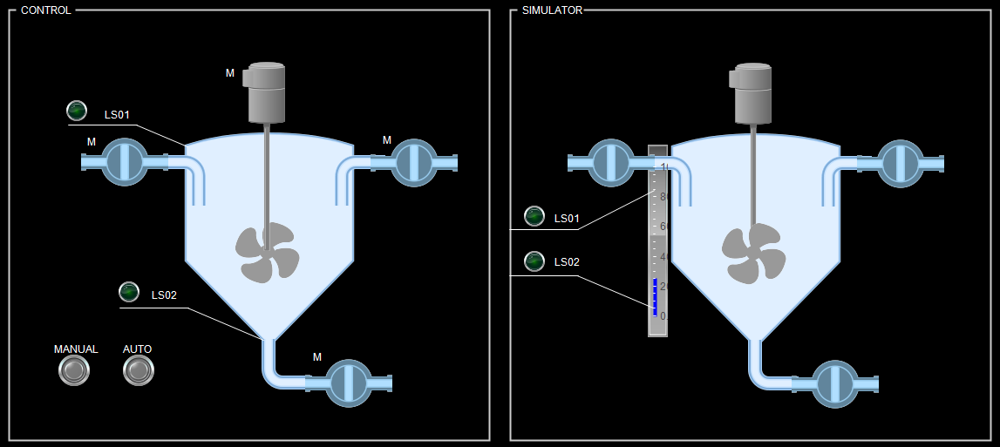

# PLC HELLO MIXING TANK

In idustrial automation the "hello world" program is a mixing tank. As a part of my portfolio I have written a simple mixing tank controller and a simulator. The project is meant for begginers and for educational purposes. It is published under MIT license. Written in CODESYS 3.5 and in structured text language.

## USAGE

The repository consists out of a CODESYS 3.5 project file, its generated PlcOpenXml and the serialized data in the docs folder.

* The codesys file can be opened with CODESYS and ran there.

* On different platforms than CODESYS the PlcOpenXml file can be used to import the data as no CODSYS native functions have been used in the project.

* Finally the user can read the code in markdown format located in this repository under docs folder or from this [link](docs/index_st.md)

<<<<<<< HEAD
## MODIFICATION FOR EDUCATIONAL PURPOSES
=======
## Modification for educational purposes
>>>>>>> a5d9112a6a99c849a6acf1660a0209bf2a974bf0

The project is designed in a way that the user can disable the main program and replace it with his own implementation. Simulator and the HMI sees only the IO and HMI global variables so if the user wishes to create an own implementation those variables should be written. On the simulator side the operator can see if the implementation is working correctly.

## LICENSE

This project is meant as a tutorial and as it it can be used under the MIT license.
